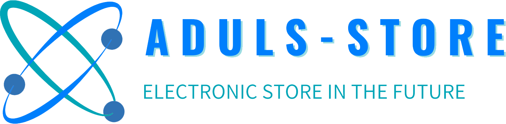

## About Aduls - Store
Aduls - Store is a Basic E-Commerce App using Bootstrap 5, basically it's using manual payment method to check.
## Let's Meet the Team
- Ahmad Abdul Fatah as Fullstack Developer (more into Front-end)
- Syekh Maulana Wijaya as Fullstack Developer (more into Back-end)
- Alfian Mohammad Rizki as Documentation
## MY SQL LINK
- [mysql, database link](https://drive.google.com/file/d/1p-j6895Ps4zmUNXzdXHY830-5gbEN2fp/view?usp=share_link).
## BUG AND ERROR FIX - !MUST READ!
- Don't forget to run 'npm install' to install a required dependency
- Don't Forget to run 'npm run dev'
- also run 'php artisan storage:link' to do a storage link
- Some of case will got a bug while adding a new Product from Admin mode. to fix this issue, try:
- 1. Delete storage folder on public folder
- 2. Re-run php artisan storage:link
- 3. Try to check by add a product
- hope it solve your problem
## WE ARE FROM TELKOM UNIVERSITY

